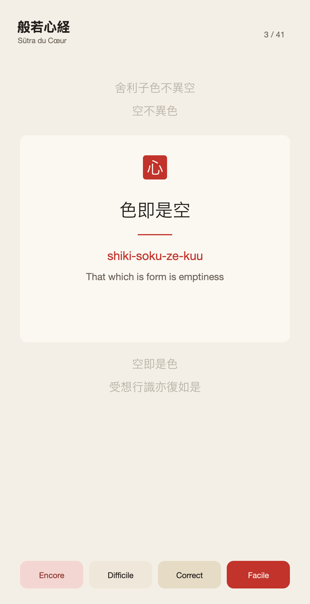
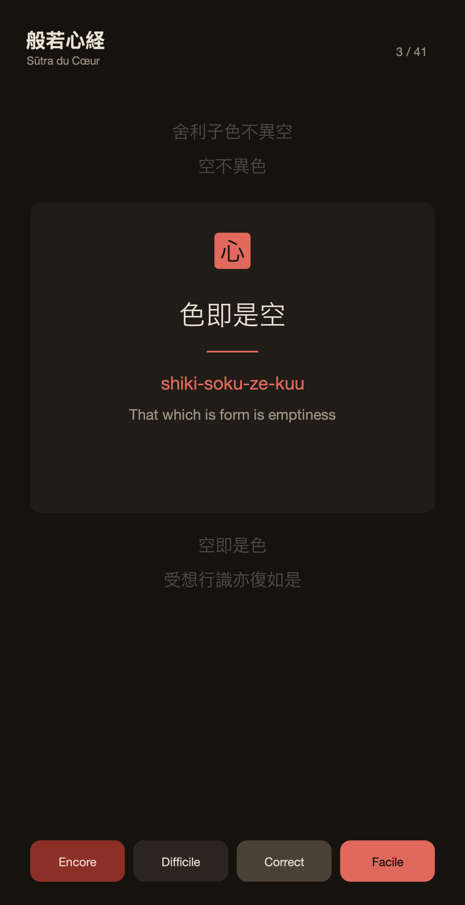

<div align="center">


# Sūtra du Cœur · 般若心経

Une application Android pour **apprendre par cœur le Sūtra du Cœur** (Hannya Shingyō)
grâce à des fiches de révision espacée, et pour **apprendre à tracer chaque kanji**.

</div>

---

## Idée

Le texte est découpé en ~41 segments. Chaque fiche présente **un segment central**
sous ses trois formes — kanji originaux, prononciation romanisée, traduction anglaise —
entouré des **deux segments qui précèdent et qui suivent** (estompés) pour situer le
passage dans la récitation. Un système de **répétition espacée (SRS)** décide quoi
réviser et vous notez votre mémorisation. Le **texte intégral** reste consultable à
tout moment, et un **tracé animé des kanji** (ordre et sens des traits) aide à les
écrire à la main.

L'interface est en français ; le sūtra reste toujours trilingue.

<div align="center">
&nbsp;&nbsp;

<br/><em>Maquettes du design — thème clair et sombre.</em>
</div>

## Fonctionnalités

- 🎴 **Fiches** : segment central + 2 segments de contexte au-dessus et en dessous.
- 🧠 **Répétition espacée** (SM-2 allégé) avec quatre notes : *Encore / Difficile / Correct / Facile*.
- 📖 **Texte intégral** parcourable, avec repère des fiches à réviser.
- ✍️ **Tracé animé des kanji** (ordre des traits), via les données [KanjiVG](https://kanjivg.tagaini.net).
- 🎨 Design « encre sumi sur papier washi, sceau vermillon », avec sélecteur de thème **Système / Clair / Sombre**.
- 📴 100 % hors-ligne — aucune donnée réseau, cohérent avec une pratique de méditation.

## Stack technique

Kotlin · Jetpack Compose (Material 3) · Navigation-Compose · DataStore · kotlinx.serialization
Un seul module `:app`, MVVM. compileSdk 34, minSdk 26.

## Compiler et installer

```bash
# Prérequis : Android SDK ; renseigner local.properties -> sdk.dir=<chemin du SDK>
./gradlew installDebug     # compile et installe sur un appareil connecté (débogage USB)
./gradlew assembleDebug    # produit app/build/outputs/apk/debug/app-debug.apk
./gradlew test             # tests unitaires (moteur SRS)
```

## Régénérer les données de tracé (KanjiVG)

```bash
python3 tools/build_kanjivg.py   # télécharge les ~118 kanji du sūtra depuis KanjiVG
```

<div align="center">

</div>

## Crédits et licences

- **Code de l'application** : © 2026 Christophe Ambroise, sous licence
  **[GNU General Public License v3.0](LICENSE)** (GPL-3.0-or-later).
- **Tracés des kanji** : données dérivées du projet **[KanjiVG](https://kanjivg.tagaini.net)**
  de Ulrich Apel, sous licence **[Creative Commons BY-SA 3.0](https://creativecommons.org/licenses/by-sa/3.0/)**.
  Le fichier `app/src/main/assets/kanjivg/strokes.json` est une œuvre dérivée et reste
  distribué sous CC BY-SA 3.0 (voir `app/src/main/assets/kanjivg/NOTICE.txt`). Cette
  licence s'applique aux données, pas au code de l'application.
- **Texte du sūtra** : le Sūtra du Cœur est un texte du domaine public.
- **Icône** : sceau (hanko) 心 réalisé à la main par l'auteur.
